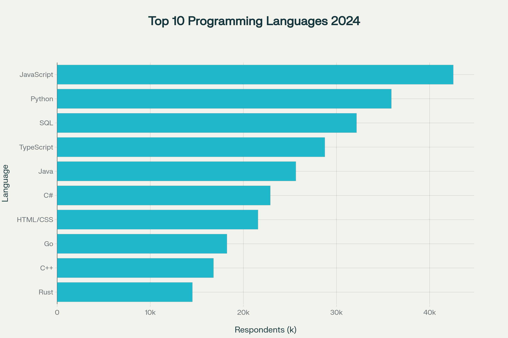
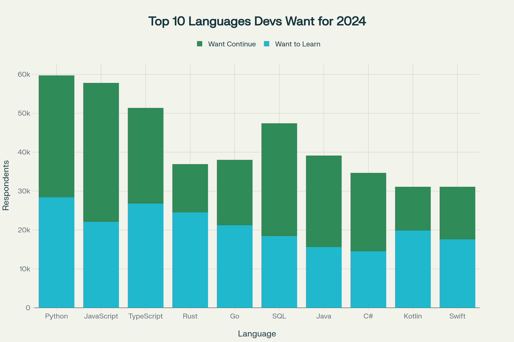
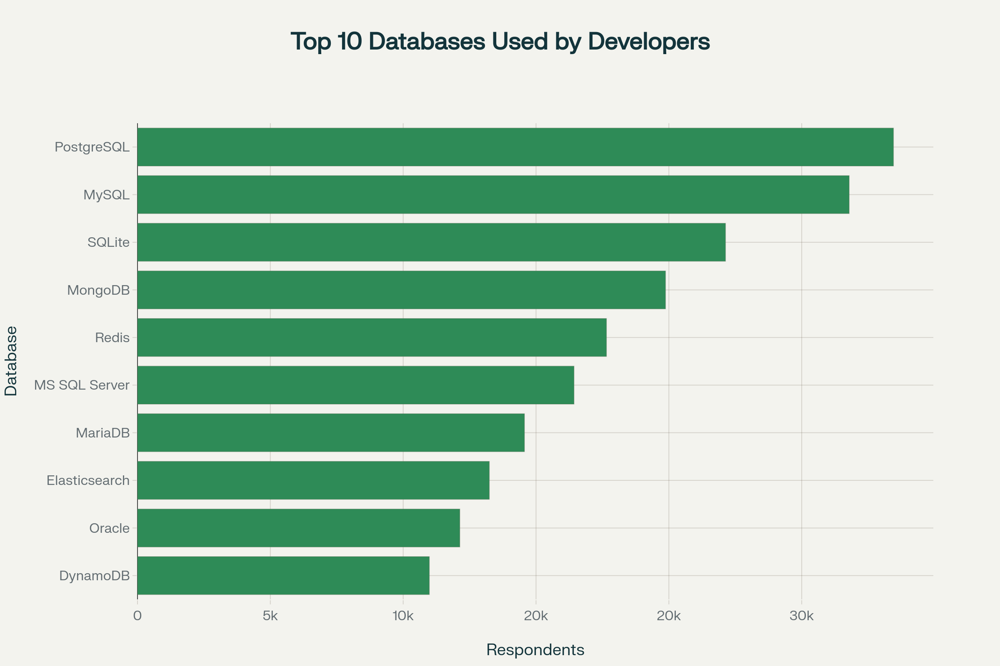
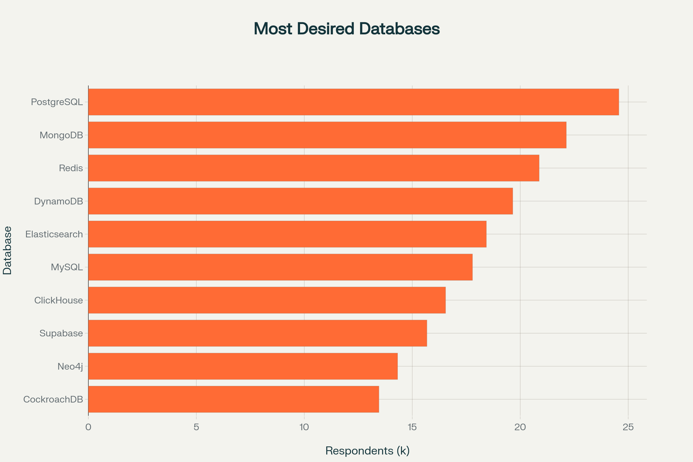

# 📊 Global Developer Skills Demand Analysis  
**Project Title:** In-demand Technical Skills – Insights from the 2024 Stack Overflow Developer Survey  

## 📌 Overview  
This project analyzes the **2024 Stack Overflow Developer Survey** (65,000+ responses from 185 countries) to uncover **technology trends** and **developer demographics**.  
The analysis provides **data-driven insights** for technical leaders, HR professionals, and organizations to align strategies with evolving industry patterns.  

Key Highlights:
- Identified **top programming languages** currently used and those developers want to learn/continue using.  
- Analyzed **database adoption trends** and future demand.  
- Visualized **platform & web framework preferences**.  
- Explored **demographics** such as age, education, and country distribution.  
- Built **interactive dashboards** in Google Looker Studio for decision-making support.  

---

## 🛠️ Tools & Technologies  
- **Python**: Data wrangling, cleaning, and visualization  
  - pandas, numpy, matplotlib, seaborn, Beautiful Soup, SQLite3, requests
- **Google Looker Studio**: Interactive dashboards  
- **Data Source**: [Stack Overflow Developer Survey 2024](https://survey.stackoverflow.co/2024/)  

---

## 📎 Deliverables  

### 📑 Report  
- [Final Project Report](Project_Report.pdf)  

### 📊 Dashboards  
- [View Dashboards](Dashboard.pdf)  
- Screenshots:  
    
    
  
    

### 📓 Jupyter Notebooks  
- 📥 [Data Collection](Data_Collection.ipynb)  
- 🧹 [Data Wrangling](Data_Wrangling.ipynb)  
- 📊 [Data Visualization](Data_Visualization.ipynb)  

---

## 📊 Key Findings  

- **Programming Languages**: JavaScript (65%), Python (49%), SQL (43%) dominate current usage. 
- **Emerging Languages**: Strong interest in Rust, TypeScript, and Kotlin for future adoption.  
- **Databases**: PostgreSQL leads with 28% adoption, followed by MySQL (22%) and SQLite (18%).  
- **Platforms**: AWS (52%), Microsoft Azure (31%), Google Cloud (28%) control the market.
- **Web Frameworks**: React.js and Node.js maintain strong developer preference. 
- **Demographics**: Majority are aged 25–44, with bachelor’s/master’s degrees, across US, India, and Europe.
- **Education**:47% hold Bachelor's degrees, 23% have Master's degrees, 15% are self-taught professionals.
---

## 🚀 Implications  
- **For Organizations**: Balance expertise in core technologies with adoption of emerging ones.  
- **For Developers**: Focus on Python, SQL, and Rust/TypeScript to stay future-proof.  
- **For HR & Training**: Align workforce development with upcoming trends.  

---
##📊 Project Stats
- 📈 Survey Responses: 65,000+
- 🌍 Countries Represented: 185
- 📊 Visualizations Created: 25+
- 🔍 Analysis Dimensions: 15+
- 📱 Interactive Dashboards: 3

---

## 📌 Author  
👤 **Sai Datta Putta**  
- 📧 Email: saidattaputta@gmail.com  
- 💼 [LinkedIn](https://www.linkedin.com/in/sai-datta-putta-b99119330/) | 💻 [GitHub](http://github.com/saidattaputta)  

---
